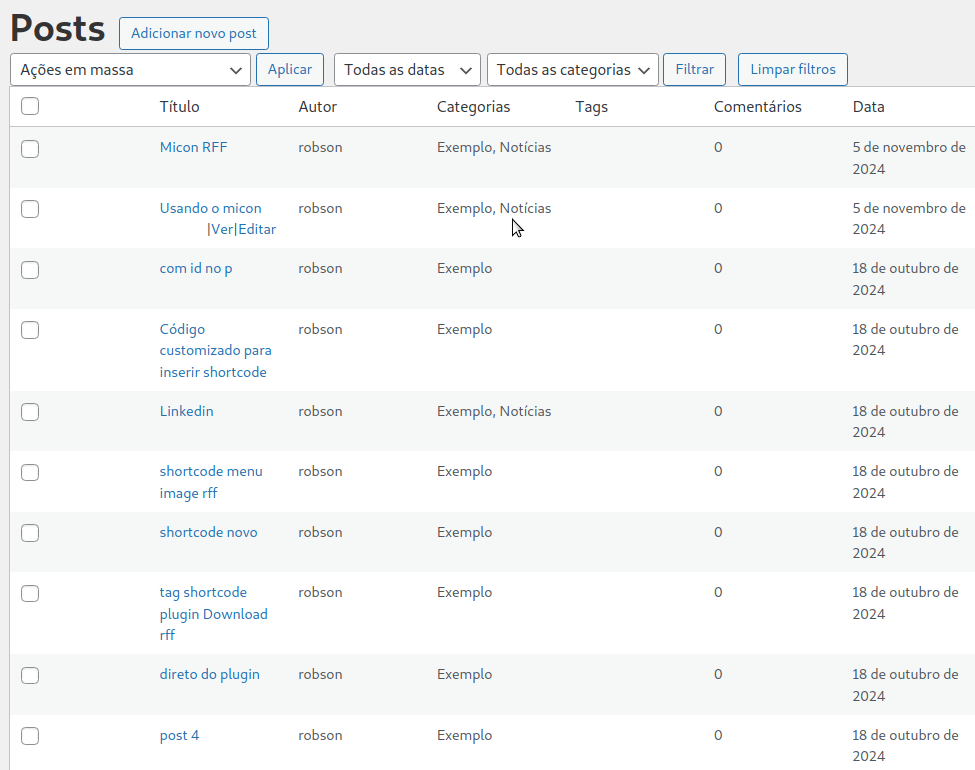

# posts-rff

## Instalação
>   A Instalação é padrão do Wordpress. Logado na área administrativa, clique em: 
> **plugins**->**Adicionar plugin**->**Enviar plugin**->**Escolher arquivo**(Você já deve ter feito o download no meu github usando o link https://github.com/robsonfdfarias/posts-rff no formato zip)->**Instalar agora**, localize o **POSTS Rff** e clique em ativar, ou, após o término do upload do plugin, clique no botão **Ativar plugin** que aparecerá.
> 

## Instruções importantes
>  Este plugin usa a mesma tabela de posts do Wordpress, ele apenas cria uma tag que diferencia do plugin de post do Wordpress. Ele foi configurado para encontrar apenas os posts criados por ele e ele não permite que o plugin de post padrão consiga criar, editar ou excluir o post criado por este plugin.  

## Criando um post
>   Para adicionar um post, clique no botão **Posts Rff**, que se encontra no menu a esquerda na área administrativa do WordPress. Clique no botão **Adicionar novo post**. Segue um exemplo: 
>   

## Editando um post
>   Para editar um post, você pode clicar no link **Editar**, ou clicar no título do post. Segue um exemplo: 
>   

## Visualizando um post
>   Para visualizar um post, você pode clicar no link **Ver**. Segue um exemplo: 
>   

## Excluindo um post
>   Para excluir um post, você pode excluir em massa, marcando a caixa de seleção(**checkbox**) de cada post que você deseja excluir, depois, em **Ações em massa**, selecionar **Excluir sem mover para lixeira**, e clicar em **Aplicar**. Segue um exemplo: 
>   

## Filtrando os posts
>   Em alguns casos é necessário filtrar os posts para poder ver apenas aqueles que você deseja, para isso, utilize os filtros. Segue um exemplo: 
> 1. Por data:
>   
> 2. Por categoria:
>   

## GraphQL
>   Você pode usar os posts criados com este plugin no GraphQL. Fazendo isso, você não terá dificuldades para usar os posts criados, pois eles estão com as configurações css em inline. Segue um exemplo de como configurar o GraphQL: 
>  
> Como é possível observar, você pode filtrar os posts usando vários tipos de filtros. Fique a vontade para testá-los.  

<h2>☺Autor</h2>
<strong>Robson Ferreira de Farias</strong> 
<ul>
  <li>Github: <a href="https://github.com/robsonfdfarias">@robsonfdfarias</a></li>
  <li>Linkedin: <a href="https://www.linkedin.com/in/robson-farias-a8b01723a/">@robsonfdfarias</a></li>
  <li>Canais do Youtube: 
  </li>
    <ul>
      <li>@robsonfdfarias: <a href="https://www.youtube.com/@RobsonFarias-os2di">RffEditor</a></li>
      <li>@informaticacomrobsonfarias: <a href="https://www.youtube.com/c/Inform%C3%A1ticacomRobsonFarias">RffEditor</a></li>
    </ul>
</ul>  

